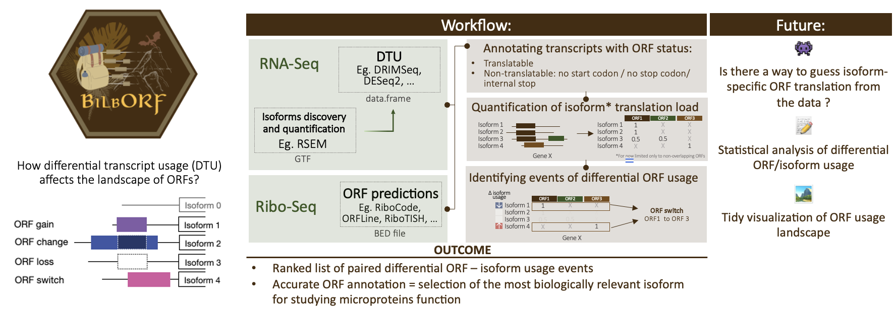

# BilbORF

[](https://opensource.org/licenses/MIT)
[](https://www.r-project.org/)

**B**ioinformatics **I**soform-aware **L**evel **b**ased **ORF** analysis

An R package for performing differential Open Reading Frame (ORF) usage analysis in the context of transcript isoform dynamics.



## Overview

BilbORF integrates transcript isoform information with ORF annotation and ribosome profiling data to identify how translation changes across different biological conditions. The package addresses the growing recognition that proteome complexity extends far beyond the classical ~20,000 protein-coding genes, with estimates suggesting 70,000+ proteoforms when considering alternative isoforms and novel ORFs.

### Key Features

- **Isoform-aware ORF annotation**: Map ORFs to transcript isoforms and determine their translation competency
- **Translation status classification**: Identify translatable ORFs vs. those with stop codons, missing start/stop codons
- **Ribosome profiling integration**: Quantify P-site coverage and frame preferences from Ribo-seq data  
- **Differential ORF usage**: Link differential transcript usage (DTU) to changes in ORF translation
- **Visualization tools**: Generate heatmaps showing ORF-isoform relationships

## Installation

### Prerequisites

BilbORF requires R >= 4.0 and depends on several Bioconductor packages:

```r
# Install BiocManager if needed
if (!requireNamespace("BiocManager", quietly = TRUE))
    install.packages("BiocManager")

# Install Bioconductor dependencies
BiocManager::install(c(
    "rtracklayer",
    "GenomeInfoDb", 
    "GenomicFeatures",
    "ORFik",
    "BSgenome.Hsapiens.UCSC.hg38"  # or your genome of interest
))
```

### Install BilbORF

```r
# Install from GitHub
# install.packages("devtools")
devtools::install_github("ashakru/BilbORF")
```

## Quick Start

```r
library(BilbORF)
library(BSgenome.Hsapiens.UCSC.hg38)
library(rtracklayer)

# 1. Prepare transcript annotations from GTF
gtf <- "path/to/annotations.gtf"
annotations <- prepare_annotations_fromGTF(gtf, BSgenome.Hsapiens.UCSC.hg38)

# 2. Load ORF coordinates (BED format)
orfs <- import("path/to/orfs.bed", format = "BED")
names(orfs) <- orfs$name

# 3. Prepare transcript metadata
transcripts_meta <- import(gtf, format = "GTF") %>%
  as.data.frame() %>%
  filter(type == "transcript") %>%
  select(gene_name, gene_id, transcript_id, transcript_type) %>%
  distinct()

# 4. Annotate ORF status across isoforms
annotated_orfs <- annotate_orf_isoforms(
  annotations, 
  orfs, 
  BSgenome.Hsapiens.UCSC.hg38,
  transcripts_meta
)

# 5. Quantify ribosome P-sites (optional, if you have Ribo-seq data)
offsets <- data.frame(fraction = 25:30, offsets_start = -12)
orf_translation <- count_p_sites("path/to/riboseq.bam", offsets, annotated_orfs)

# 6. Analyze differential ORF usage
orf_landscape <- diff_orf_usage(
  annotated_orfs$table,
  dtu_results,  # from DRIMSeq or similar
  selected_genes
)
```

## Workflow Details

### 1. ORF Translation Status

BilbORF classifies ORFs into five categories based on their sequence:

- **translatable**: Valid start and stop codons, no internal stops
- **internal_stop**: Contains internal stop codon(s)
- **no_stop**: Missing valid stop codon
- **no_start**: Missing valid start codon  
- **no_stop_no_start**: Missing both start and stop codons

### 2. Input File Formats

**ORF BED file** must contain:
- `chrom`: Chromosome name (matching annotation)
- `chromStart`: Start codon position (+ strand) or stop codon (- strand)
- `chromEnd`: Stop codon position (+ strand) or start codon (- strand)
- `name`: Unique ORF identifier
- `strand`: +/-

**DTU results** table requires:
- `transcript_id`, `gene_id`, `gene_name`
- `pvalue`, `adj_pvalue`, `rank` (e.g., log2FoldChange)

### 3. Visualization Example

```r
library(ComplexHeatmap)

# View ORF usage for specific gene
gene_id <- "ENSG00000156110.14"
gene_tab <- orf_landscape$gene_tables[[gene_id]]

# Create heatmap showing DTU and ORF status
# See vignette for complete visualization code
```

## Documentation

- **Vignette**: See `vignettes/core_workflow.Rmd` for detailed examples
- **Function documentation**: `?annotate_orf_isoforms`, `?count_p_sites`, `?diff_orf_usage`
- **Prerequisites**: [Background reading](https://github.com/ashakru/BilbORF/blob/main/doc/prerequisites.md)

## Citation

If you use BilbORF in your research, please cite:

```
Krupka, J.A. (2024). BilbORF: Differential ORF usage analysis. 
https://github.com/ashakru/BilbORF
```

## Background & References

- [Review on emerging new ORFs in the human genome](https://www.sciencedirect.com/science/article/pii/S1535947623001421)
- [Isoform-aware ORF annotation publications](https://github.com/ashakru/BilbORF/blob/main/doc/prerequisites.md)

## Contributing

Contributions are welcome! Please open an issue or submit a pull request.

## License

MIT License - see [LICENSE](LICENSE) file for details.

## Contact

Joanna Krupka - jak75@cam.ac.uk  
ORCID: [0000-0003-0369-0329](https://orcid.org/0000-0003-0369-0329)
