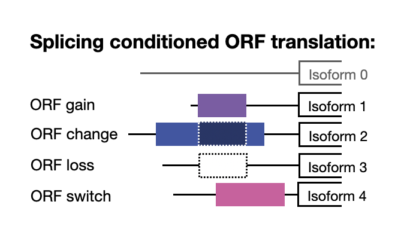

```{r, include = FALSE}
knitr::opts_chunk$set(
  collapse = TRUE,
  comment = "#>"
)
```

# Introduction 

The human genome is thought to contain approximately 20,000 protein-coding sequences.
However, emerging evidence suggest that the complexity of protein-coding regions is far more than that. 

```{r out.width = '70%', echo = FALSE}

```

# Prerequisites 

```{r setup}
library(BilbORF)
```

# Workflow 

## Prepare annotation

```{r annotations}
library(BSgenome.Hsapiens.UCSC.hg38)

BSgenome <- BSgenome.Hsapiens.UCSC.hg38
gtf <- "inst/extdata/gencode.v35.annotation_chr10.gtf"

# Prepare annotations
annotations <- prepare_annotations_fromGTF(gtf, BSgenome)
```

## Identify ORF translation status depending on ORFs

```{r orf_status}
bed <- "inst/extdata/Ribo-seq_ORFs.bed"

# Pull transcripts metadata
transcripts_meta <- import(gtf, format = "GTF") %>%
  as.data.frame() %>%
  dplyr::filter(type == "transcript") %>%
  dplyr::select(gene_name, transcript_id, transcript_type) %>%
  distinct()

# Load ORFs
orfs <- import(bed, format = "BED")
names(orfs) <- orfs$name
orf_tab <- as.data.frame(orfs)

# Annotate ORF status on all overlapping transcripts 
annotated_orfs <- annotate_orf_isoforms(annotations, orfs, BSgenome, transcripts_meta)
```
